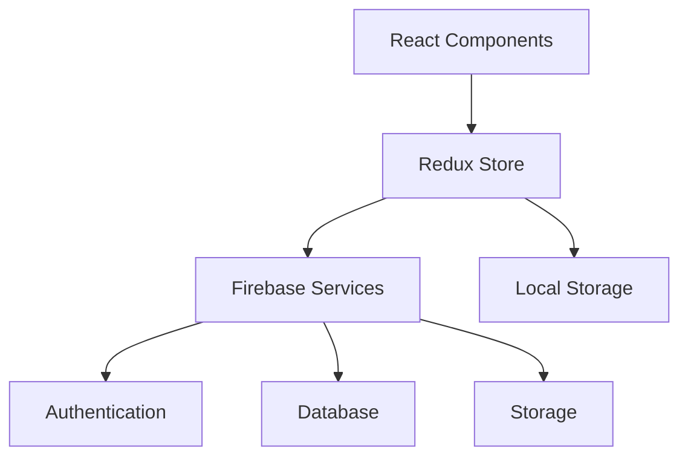

# React Retail 🛍️

A modern e-commerce platform built with React, Redux, and Firebase, offering a seamless shopping experience with robust features and a scalable architecture.

[](https://choosealicense.com/licenses/mit/)
[](https://reactjs.org/)
[](https://redux.js.org/)
[](https://firebase.google.com/)

## 📋 Table of Contents

- [React Retail 🛍️](#react-retail-️)
  - [📋 Table of Contents](#-table-of-contents)
  - [✨ Features](#-features)
  - [🛠 Technology Stack](#-technology-stack)
    - [Frontend](#frontend)
    - [Backend Services](#backend-services)
    - [Development Tools](#development-tools)
  - [🏗 Architecture](#-architecture)
  - [🚀 Getting Started](#-getting-started)
    - [Prerequisites](#prerequisites)
    - [Installation](#installation)
  - [📁 Project Structure](#-project-structure)
  - [💾 State Management](#-state-management)
    - [Redux Store Structure](#redux-store-structure)
  - [📜 Available Scripts](#-available-scripts)

## ✨ Features

- **Product Catalog**: Browse through categorized products with detailed views
- **Shopping Cart**: Real-time cart management with quantity adjustments
- **Checkout Process**: Streamlined checkout experience
- **Search & Filter**: Advanced product search and filtering capabilities
- **Authentication**: Email/password and Google sign-in options
- **State Management**: Centralized Redux store with persistent storage
- **Performance Optimized**: Fast loading times and efficient data handling

## 🛠 Technology Stack

### Frontend
- React 18
- Redux + Redux Toolkit
- React Router DOM
- Styled Components
- SASS

### Backend Services
- Firebase Authentication
- Cloud Firestore
- Firebase Storage

### Development Tools
- Redux Logger
- Redux Persist
- Reselect
- React Testing Library

## 🏗 Architecture



## 🚀 Getting Started

### Prerequisites

- Node.js (≥ 14.0.0)
- npm or yarn
- Firebase account

### Installation

1. Clone the repository:
```bash
git clone https://github.com/your-username/react-retail.git
cd react-retail
```

2. Install dependencies:
```bash
npm install
```

3. Configure environment variables:
```bash
cp .env.example .env
```

4. Update `.env` with your Firebase credentials:
```env
REACT_APP_FIREBASE_API_KEY=your_api_key
REACT_APP_FIREBASE_AUTH_DOMAIN=your_auth_domain
REACT_APP_FIREBASE_PROJECT_ID=your_project_id
REACT_APP_FIREBASE_STORAGE_BUCKET=your_storage_bucket
REACT_APP_FIREBASE_MESSAGING_SENDER_ID=your_messaging_sender_id
REACT_APP_FIREBASE_APP_ID=your_app_id
```

## 📁 Project Structure

```
react-retail/
├── public/
│   ├── _redirects              # Netlify redirects
│   ├── index.html
│   ├── manifest.json
│   └── robots.txt
├── src/
│   ├── components/             # Reusable UI components
│   │   ├── button/
│   │   ├── cart-dropdown/
│   │   ├── cart-icon/
│   │   ├── cart-item/
│   │   ├── category-preview/
│   │   ├── checkout-item/
│   │   ├── directory/
│   │   ├── form-input/
│   │   ├── product-card/
│   │   └── sign-in-form/
│   ├── routes/                 # Application routes
│   │   ├── authentication/
│   │   ├── categories-preview/
│   │   └── checkout/
│   ├── store/                  # Redux store configuration
│   │   ├── user/
│   │   ├── cart/
│   │   └── categories/
│   ├── utils/                  # Utility functions
│   ├── App.js                  # Main application component
│   └── index.js               # Application entry point
└── package.json
```

## 💾 State Management

### Redux Store Structure

```javascript
{
  user: {
    currentUser: null,
    error: null,
    loading: false
  },
  cart: {
    items: [],
    isOpen: false,
    total: 0
  },
  categories: {
    collections: [],
    loading: false,
    error: null
  }
}
```

## 📜 Available Scripts

| Command | Description |
|---------|-------------|
| `npm start` | Start development server |
| `npm test` | Run test suite |
| `npm run build` | Build for production |
| `npm run eject` | Eject from Create React App |

